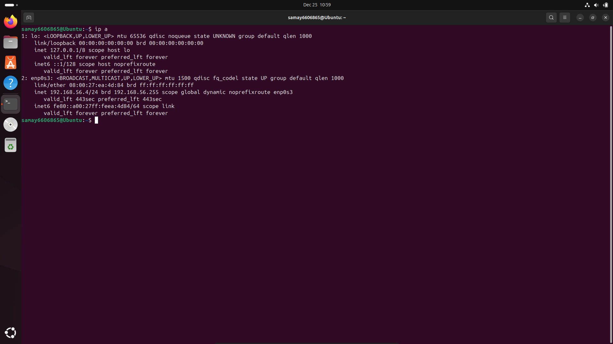
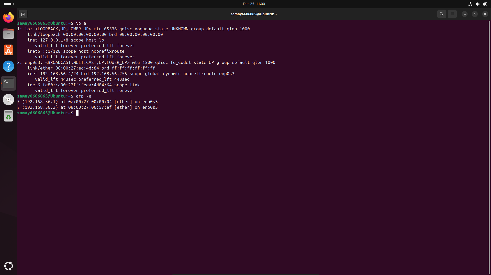
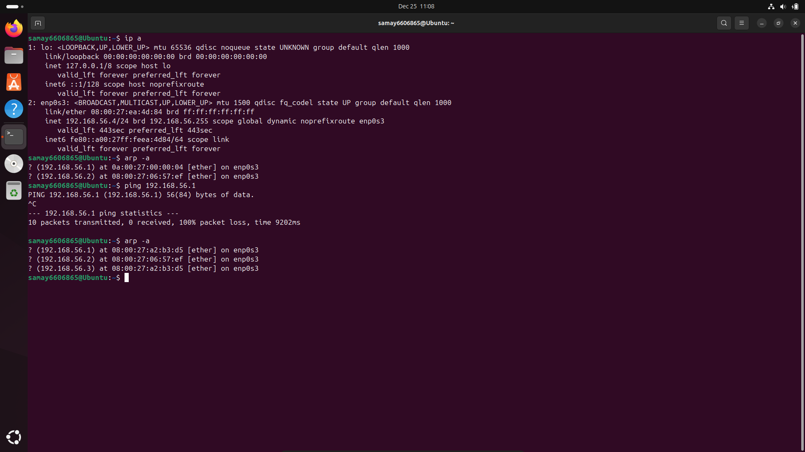
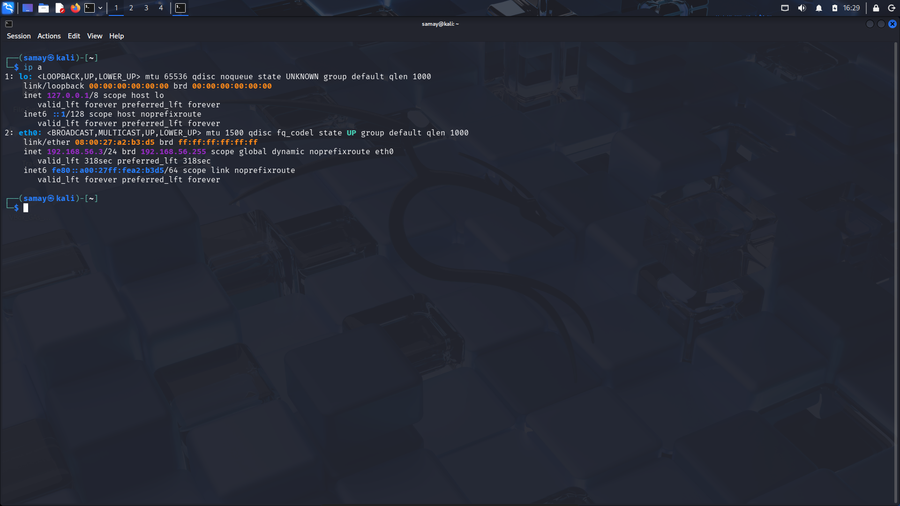

ARP-spoofing-virtual-lab / screenshots
## 🖼️ Screenshots (Proof of Execution)

### Victim Machine (Ubuntu)

**Victim IP Address**

**ARP Table Before Attack**

**ARP Table After Attack**

---

### Attacker Machine (Kali Linux)

**Kali IP Address**

**IP Forwarding Enabled & ARP Spoof Running**

---

### Network & DHCP Configuration

